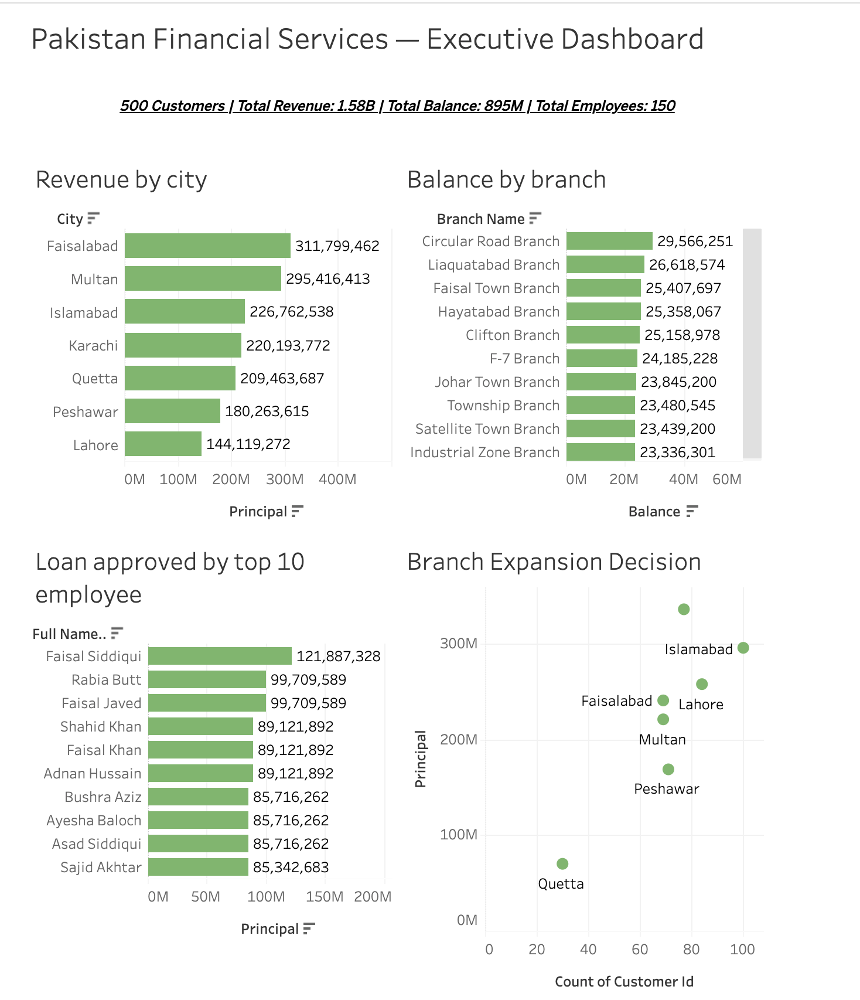

# 🏦 Pakistan Financial Services — MySQL Database

A relational database simulating a Pakistani financial institution with 9 normalized tables,
500 customers, 30 branches across 7 cities, and a Tableau Executive Dashboard.

---

## 📊 Dashboard

🔗 [View Live on Tableau Public](https://public.tableau.com/app/profile/muhammad.ammar.saleem/viz/PakistanFinancialServicesExecutiveDashboard/PakistanFinancialServicesExecutiveDashboard)

---

## 🗂️ Schema Overview

| Table | Description |
|---|---|
| `branches` | 30 branches across 7 cities and 4 regions |
| `customers` | 500 customers with income, city, and branch info |
| `accounts` | Savings, Current, and Fixed Deposit accounts |
| `employees` | 150 staff with designation and salary |
| `loans` | Loans with type, status, interest rate, tenure |
| `loan_payments` | Payment history with late fees |
| `transactions` | Deposits, withdrawals, transfers by channel |
| `credit_cards` | Visa, Mastercard, UnionPay cards |
| `audit_log` | Action log for cards, loans, accounts, customers |

---

## 💡 Key Insights

- **Faisalabad** generates the highest loan revenue at 311M PKR
- **Circular Road Branch** holds the highest account balance at 29.5M PKR
- **Faisal Siddiqui** is the top loan-approving employee at 121M PKR
- **Islamabad** is the top city for branch expansion — highest customer count with strong loan volume. **Karachi** leads in total loan revenue at ~340M PKR.
- **Quetta** shows lowest activity — not recommended for expansion

---

## 🛠️ Tools Used

- MySQL — database design and queries
- Tableau Public — dashboard and visualization
- Git & GitHub — version control

---

## 👤 Author

**Muhammad Ammar Saleem**
GitHub: [m2ammar](https://github.com/m2ammar)
